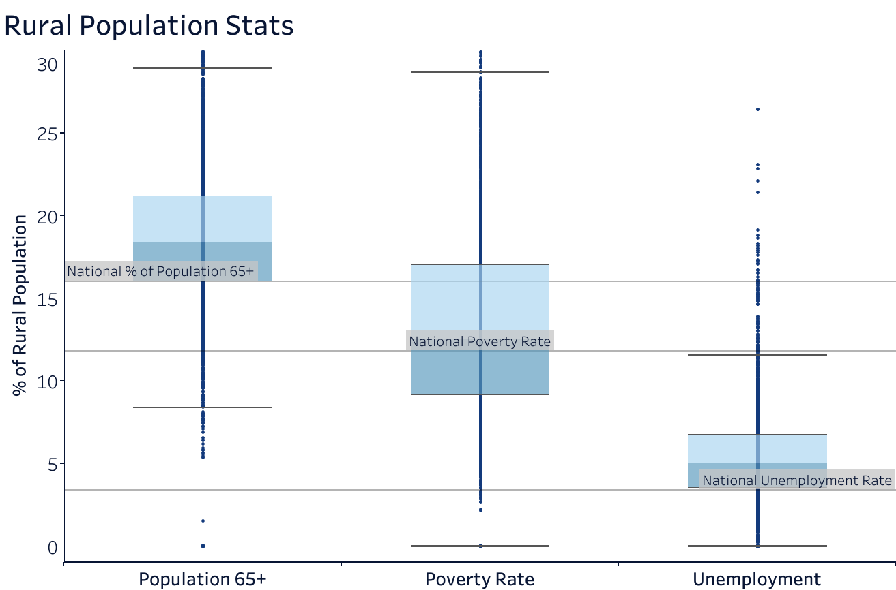
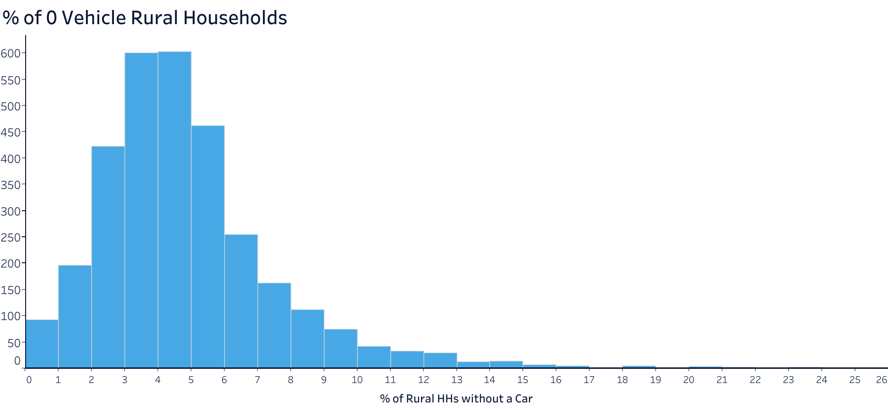
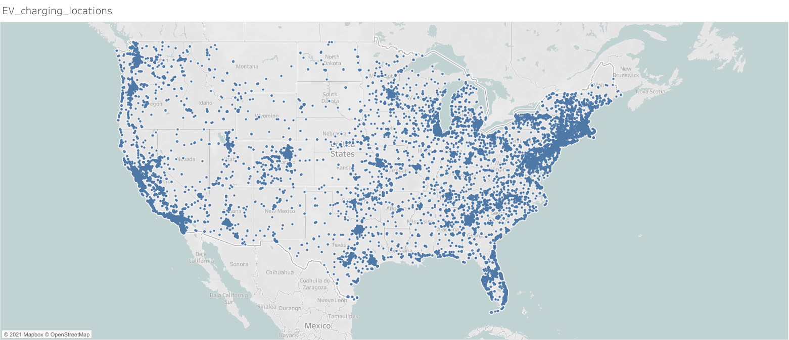

# Investing in Electric Vehicle (EV) Infrastructure MVP

## Purpose/Problem:
Ford would like to improve EV infrastructure in under-served communities to facilitate the sale and upkeep of EVs, with a specific focus on van and pickup truck customers. As Ford moves towards fulfilling this goal, they're seeking advice regarding: 
1) Which communities are currently under-served and within the scope of the desired customer base.
2) Which communities they should prioritize as they roll out this new infrastructure.

### Rural Community Characterization:

Rural communities have a larger senior population compared to the national average. Their percentage of the population living below the poverty line is also slightly higher than the national average. Additionally, their unemployment rate is higher than the national average. 

| Category | National Rate | Rural Rate|
| ------- | ------------- | --------- |
| Senior Population | 16.0% | 18.4 % |
| Living Below Poverty Line | 11.8% | 12.5% |
| Unemployment | 3.4% | 5.0% |
| 0 Vehicle Households | 9.0% | 4.4% |

Overall, % of 0 vehicle households in rural areas is much lower than the national average. This indicates that rural communities are more likely to own cars, and thus, they could be a good target demographic for Ford.

### EV Charging Station Locations

The map showcases which areas of the US are more in need of EV charging stations to support consumers. For a better view, you can look at my [tableau workbook](https://public.tableau.com/app/profile/louisa.reilly/viz/adopt_ev/EV_charging_locations) and browse through the other visualizations created that were not included in the MVP.