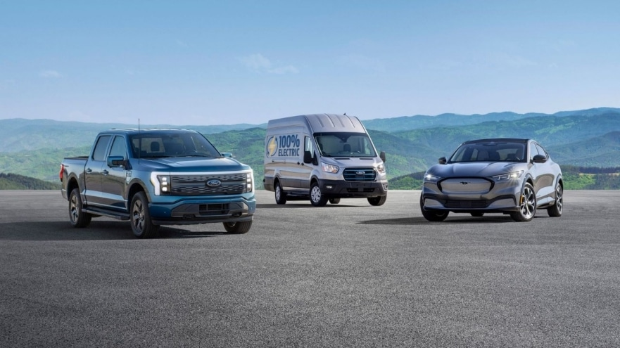
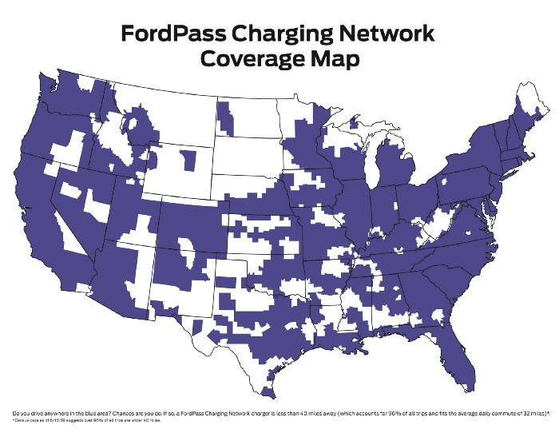
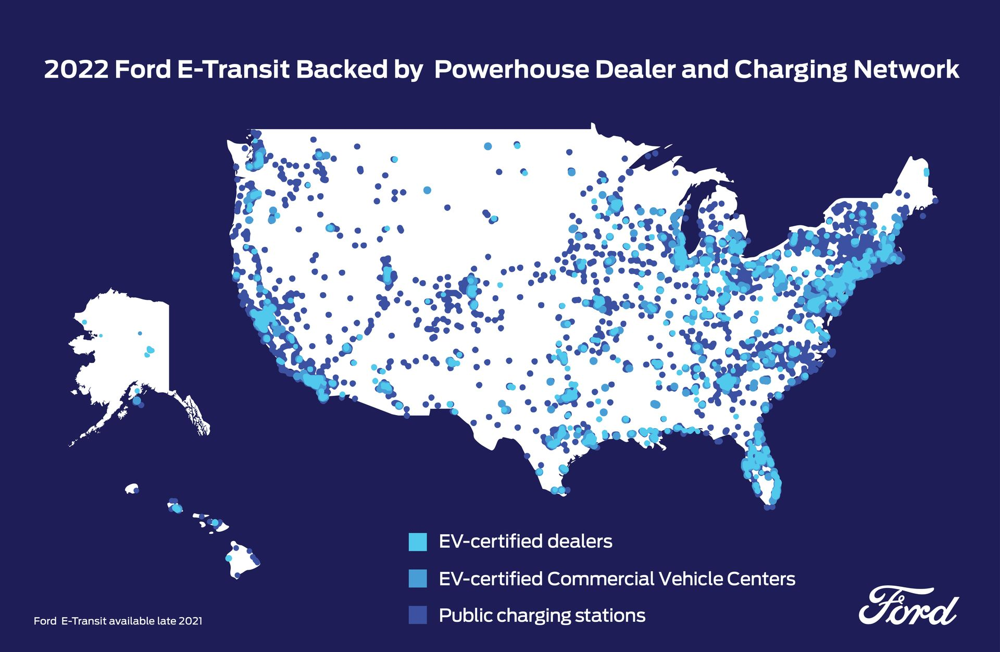

# Investing in Electric Vehicle (EV) Infrastructure

## Backstory:

The Department of Energy (DOE) has revealed new research funding opportunities focusing on topics related to electric vehicle (EV) charging.[1](https://www.whitehouse.gov/briefing-room/statements-releases/2021/04/22/fact-sheet-biden-administration-advances-electric-vehicle-charging-infrastructure/)

- $4 million to promote strong partnerships and programs that increase workplace charging (regionally or nationally) to make PEV ownership more realilistic for consumers in underserved communities, such as demographics that are unable/ minimally able to charge vehicles at home.

- $10 million for the research, development, and demonstration of novel technologies that mitigate the costs of DC Fast charging equipment for EVs that lay the groundwork for increased EV adoption.

- $20 million to expedite the adoption of plug-in electric vehicles (PEVs) and its corresponding supporting infrastructure through community-based public-private partnerships. These partnerships need to demonstrate PEV technologies and infrastructure through innovative applications, share their results (data, key take-aways, and best practices) with a broader audience. Projects that stimulate clean energy jobs and/or impart novel transportation solutions to under-served communities are of particular interest.

You are pitching an innovative and novel data sciecne project focusing on enhancing EV infrastructure in under-served communities funded by one of these afforementioned DOE grants to Ford Motor Company.

---

### Client:
Ford Motor Company (otherwise known as Ford) is refining their electric vehicle strategy.[2](https://media.ford.com/content/fordmedia/fna/us/en/news/2021/05/19/the-ford-electric-vehicle-strategy--what-you-need-to-know.html) Their current plan being implemented is to make the transition to EVs smooth and seamless. Thus, they are electrifying three of their most iconic vehicles:
* Mustang Mach-E (electrified Mustang)
* E-Transit (electrified Transit, the USA's best-selling van).
* F-150 Lighting (Ford F-150, USA's top-selling truck)
---

---
The key demographic targeted by Ford is the commerical van and pickup industries. Currently, they are under-emphasized in the EV industry. Ford plans to provide these customers with more accessible pricing, enhanced productivity, and decreased ownership costs.

Ford is well-equiped to handle the EV transition for their consumers. They own North America's largest public charging network, 63,000+ charging plugs. Plus, they have over 2,300 EV-certified dealers across the United States and 644 EV-certified comercial vehicle centers. The EVs have Cloud connected navigation, which directs EV owners to the nearest charging stations and gives recommendations on places to charge on trips. Additionally, Ford customers can utilize a FordPass which provides easy access and payment for charging stations.

---

----

---
## Purpose/Problem:
Ford would like to improve EV infrastructure in under-served communities to facilitate the sale and upkeep of EVs, with a specific focus on van and pickup truck customers. As Ford moves towards fulfilling this goal, they're seeking advice regarding: 
1) Which communities are currently under-served and within the scope of the desired customer base.
2) Which communities they should prioritize as they roll out this new infrastructure.

### Data Science Solution Path:
- Exploratory data analysis
    - showcasing how rural communities are under-served
    - current and planned electric vehicle charging stations
    - commercial van and pickup trucks
        - customer-base locations
        - EV needs specific to those vehicles
- Machine Learning Model
    - Clustering Algorithm for identification of areas that truck and commercial van customers would benefit most from improved EV infrastructure
        - Guassian Mixture Models
    - Regression Algorithm to determine which of identified areas will yield a higher profit for Ford.
        - Random Forest regression
    
### Impact Hypothesis:
Investing more money, time, and resources into building EV infrastructure will facillitate more EV sales by tearing down purchasing barriers and create new avenues of revenue for the company. The major impacts are:
1) Building more charging stations to support the sale of EVS.
2) Supporting rural communities.

### Solution Path:
Cluster analysis or clustering is a plausible solution. It is an unsupervised learning problem, where the algorithm automatically arranges the data into natural groups.

The algorithm of interest for discovering the natural groups of truck customers in need of EV charging stations is k-means clustering. The algorithm aims to separate n observation into k clusters where each observation belongs to the cluster with the nearest cluster center.

### Measures of Success:
#### Technical:
- Clustering Tendency
    - Hopkins test. If H >0.5, then the data is most likely not uniformly distributed and contains clusters.
- Number of Optimal Clusters
    - Square root of N/2 where N is the total number of data points. Each cluster shall contain square root of 2*N.
- Clustering Quality
    - Average silhouette coefficient value of all objects in the cluster.

#### Non-Technical:
- There is at least a 5% (or more) increase in sales of the 2022 Ford F-150 Lightning electric trucks compared to the 2021 F-150 model.
- FordPass app downloads increase by at least 8% compared to the previous year. 
- There is at least a 6% increase in usage of the FordPass app features:
    - Locating nearby charging stations
    - Power My Trip (tool for trip planning that considers the vehicles current charge state and identifies charging points along the trip route).\
    - Monitoring charging process

### Assumptions:
- The data is not uniformly distributed.
- Truck owners will want to convert to EV.
- The most popular truck make in the target areas is Ford.
- Customers can afford an EV and to potentially replace or repair its battery.

### Risks:
- Lose money from building EV charging station(s), but the station(s) is/are seldom used.
- Copper theft of new EV charging stations.
- Ground Fault Circuit Interrupter (GFCI) breaker failure.
- Unforseen EV charging station maintenance issues due to the weather. e.g. lightning, heat, humidity, cold, and snow/ice.

## Data:
- [Federal Highway Administration - State Motor Vehicle Registrations](https://www.fhwa.dot.gov/policyinformation/statistics/2019/)
    - Utilize the total trucks registered per state to determine which states have the most trucks.
    - Determine the % of trucks registered to total automobiles registered per state to find which states proportionally have the most trucks. 
- [Department of Energy: Energy Efficiency and Renewable Energy - Alternative Fuels Data Center](https://afdc.energy.gov/data_download/)
    - Map EV charging locations.
    - Visualize number of stations opened per year.
- [Access to Intercity Transportation in Rural Areas](https://data.bts.gov/Research-and-Statistics/Access-to-Intercity-Transportation-in-Rural-Areas/29cj-8s4a)
    - Demonstrate that Rural areas are under-served communities. 
    - Compare their % below poverty, unemployment rate, senior population, and car-free households to the national average.

## Algorithms:
- Thorough exploratory analysis in Excel and Tableau.
- Datasets will be cleaned and currated for exploration, aggregation, and visualization.

## Tools:
- Excel/ Google Sheets.
- Tableau visualization
- PowerPoint for presentation/ pitch.

### Visuals:
- Tableau
    - [Truck Registration and EV charging stations Dashboard](https://public.tableau.com/app/profile/louisa.reilly/viz/EV_Charge_Truck_Van/Dashboard1)
    - [Rural Area Inequality and Transit Access Dashboard](https://public.tableau.com/app/profile/louisa.reilly/viz/adopt_ev/NoVehicleHH)
- Excel/Sheets
    - [Vehicle Registration and Pickup Sales](https://drive.google.com/file/d/1f_OABwwDtmueD4rspmIt1og5_RXHw1OU/view?usp=sharing)
    - [Rural Transit Access Viz](https://drive.google.com/file/d/1ZSLMATZvGjxOhc1BtvJioeBb2pOQex_N/view)
        - Note the file is too large to show in sheets, but there are many vizualizations. 
    
### Sources:
1. [Biden Administration Advances Electric Vehicle Charging Infrastructure](https://www.whitehouse.gov/briefing-room/statements-releases/2021/04/22/fact-sheet-biden-administration-advances-electric-vehicle-charging-infrastructure/)
2. [The Ford Electric Vehicle Strategy: What you need to Know](https://media.ford.com/content/fordmedia/fna/us/en/news/2021/05/19/the-ford-electric-vehicle-strategy--what-you-need-to-know.html)
3. [Leaving the niche: Seven steps for a successful go-to-market model for electric vehicles](https://www.mckinsey.com/industries/automotive-and-assembly/our-insights/leaving-the-niche-seven-steps-for-a-successful-go-to-market-model-for-electric-vehicles#)
